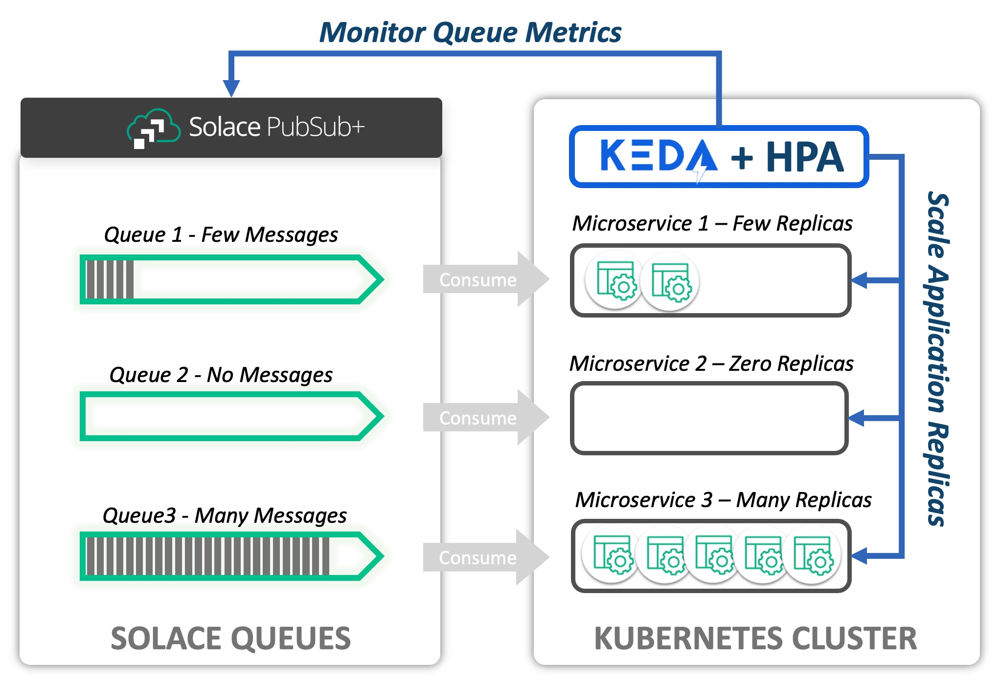

auhor: Peter Kester
summary: Deploy KEDA and Scale an Application on Kubernetes by Monitoring a Solace PubSub+ Queue all running on K8S on Mac

# KEDA with Solace PubSub+ Event Queues

# Introduction
The purpose of this CodeLab is to provide an introduction to the **Solace PubSub+ Event Broker Queue Scaler** for KEDA, and to show how these tools can be used to scale Consumers of Solace Queues elastically in a Kubernetes environment.  
This is based on the codelab [KEDA with Solace PubSub+ Event Queue](https://codelabs.solace.dev/codelabs/keda-solace-queue/?index=..%2F..index#0)
and extended for use on a K8S cluster running in Podman on a Mac. The hardcoded parts are removed and replaced with k8s secrets and configmaps

### What is KEDA?
[KEDA](https://keda.sh) is a [CNCF](https://www.cncf.io) sandbox project (current as of this writing). KEDA expands the capability of the native [Kubernetes Horizontal Pod Autoscaler](https://kubernetes.io/docs/tasks/run-application/horizontal-pod-autoscale/). It does this by providing an interface for HPA to retrieve custom metric values that can be used for scaling.

### What is the Solace Scaler?
The Solace PubSub+ Event Broker Queue Scaler defines an interface that allows KEDA to scale applications based on Solace Queues, specifically the current Message Count and Message Spool Usage. Based on the observed values of these metrics, KEDA and HPA can scale target Deployments, Jobs, and Stateful Sets in response to fluctuating demand. The Solace Scaler itself is merged into the KEDA project and is therefore available when KEDA is installed.

Consider the following diagram. A Solace PubSub+ Event Broker hosts a set of queues. The messages from each queue are being consumed by a microservice deployed to a Kubernetes cluster. KEDA uses the Solace Scaler to interface with the PubSub+ Broker via the SEMP API to obtain metrics related to the queue. In this example, we are interested in Message Count. Based on the Message Count retrieved for each queue, KEDA and the Horizontal Pod Autoscaler maintain the appropriate number of desired replicas.



### The Goal
The instructions in this CodeLab will provide a practical guide to using KEDA for the purpose of scaling consumers of Solace Queues.
It also shows techniques for parametrized deployments

## Prerequisites

### Proficiencies
This Codelab assumes that you have at least minimum proficiency with:
- Kubernetes, including command line administration using `kubectl` command
- Solace PubSub+ Event Broker
- Messaging system concepts

### Desktop Software
You must have the following command line tools available to complete the CodeLab.
- [kubectl](https://kubernetes.io/docs/tasks/tools/)
- [Helm](https://helm.sh/docs/intro/quickstart/)

### Kubernetes
Access to a Kubernetes cluster from your desktop is required to complete the Codelab. You will need sufficient priviledges to create and delete Pods, Deployments, StatefulSets, Services, and Secrets. The following minimum resources on the Kubernetes cluster are recommended:
- 2 CPU
- 5 GBytes Memory
- 8 GBytes Disk Space

We are using Podman on Mac, which has one snall problem with thh loadbalancer that can be bypassed by making use of port forwarding.

## Next steps

### Install Software
We will use **Helm** to install software to your Kubernetes cluster. **Helm** charts (coded instructions for installation) are available in public repositories.
- **KEDA** - We will use **Helm** to deploy the KEDA software to the Kubernetes cluster
- **Solace PubSub+ Event Broker** (Dev Mode) - We will install a small scale Event Broker to complete the lab

### Create Deployments
We will create the following objects on the Kubernetes cluster:
- **kedalab-helper** - Kubernetes **Pod** that will be created for the purpose of running configuration scripts and to publish messages.
- **solace-consumer** - Kubernetes **Deployment** that we will scale using KEDA and the Solace Queue Scaler.

### Configure KEDA to Scale the solace-consumer Deployment
We will create the following objects to configure KEDA:
- **kedalab-scaled-object** - KEDA **ScaledObject** informs KEDA that a Scaler (Solace Event Queue Scaler for this Codelab) will be applied to our deployment
- **kedalab-solace-secret** - Kubernetes **Secret** with encoded credentials for the admin ID to connect to the Solace SEMP endpoint of our broker
- **kedalab-trigger-auth** - KEDA **TriggerAuthentication**; bridges a KEDA **ScaledObject** configuration to a Kubernetes **Secret**

### Publish Messages and Observe!
- We will use SDK-Perf utility, provided for you on **kedalab-helper** pod, to publish messages to our broker.
- Based upon the message backlogs that we create, we will observe how KEDA scales the **solace-consumer** deployment

## Install KEDA
You will need to install KEDA if it is not already available on your cluster. Instructions here are reproduced from the [KEDA Web site](https://keda.sh/docs/2.8/deploy/). We will use Helm to install KEDA. Please refer to the KEDA site if you wish to use a deployment method other than Helm to install KEDA.

> If KEDA was already installed to your cluster and you intend to use it to complete the CodeLab:<br>_It may be necessary to update the installation OR to uninstall keda and then re-install it if the Solace Scaler is not available in your installed version of KEDA. The Solace Scaler is available in KEDA core starting with version 2.4_.

### Add Helm repo for Keda (if not already added)
```
helm repo add kedacore https://kedacore.github.io/charts
```
### Add Helm repo for Solace PubSubPlus Event Broker (if not already added)
```
helm repo add solacecharts https://solaceproducts.github.io/pubsubplus-kubernetes-helm-quickstart/helm-charts
```
### Update Helm repo
```
helm repo update
```
All steps described here up until the [Create scaledObject with Solace Queue Trigger](#create-scaledobject-with-solace-queue-trigger) can be skipped by using the provided script 'start-cluster.sh'

### Create keda namespace
```
kubectl create namespace keda
```
### Install KEDA Using the Helm chart:
```
helm install keda kedacore/keda -n keda
```
### Check your installation
```
## Make sure that the deployments/pods are Ready!
kubectl get deployments -n keda
kubectl get pods -n keda
```
## Solace PubSub+ Software Event Broker - Helm Chart
Follow the instructions to install a Solace PubSub+ Event Broker to your Kubernetes cluster.  
The broker will be installed to `namespace=solace`.  
The broker will be created with an administrative user=**admin** and password=**admin**.  
We will configure the broker subsequently in the next section.

### Create solace namespace
```
kubectl create namespace solace
```

### Switch namespace
```
kubectl config set-context --current --namespace=solace
# Validate it
kubectl config view --minify | grep namespace:
```

### Install the broker
Make sure to get a local copy of the values.yaml from here: https://github.com/SolaceDev/pubsubplus-kubernetes-helm-quickstart/blob/master/pubsubplus/values.yaml if you are on a Mac and save it as `values-mac.yaml`
Adjust the section for port 55555 on lines 161 - 164 as below when you are a Mac user. All other users can leave the servicePort as is.
```
      - servicePort: 55554
        containerPort: 55555
        protocol: TCP
        name: tcp-smf
```

Install the broker with the values-mac.yaml file and admin password `admin`
```
##  This installation will use ephemereal storage, which means if pod is shut down and restored, the configuration will be lost.
helm install kedalab solacecharts/pubsubplus-dev -f values-mac.yaml -n solace \
    --set solace.usernameAdminPassword=admin \
    --set storage.persistent=false
```

If you are on windows or linux you can run below command to deploy the broker with admin password `admin`.
```shell
helm install kedalab solacecharts/pubsubplus-dev -n solace \
  --set solace.usernameAdminPassword=admin 
  --set storage.persistent=false
```
### Wait and Verify
```
## Command will hold until the pod = kedalab-pubsubplus-dev-0 is ready for use
## Note: This make take up to a minute if you execute immediately after deploying the broker
kubectl wait -n solace --for=condition=Ready --timeout=120s pod/kedalab-pubsubplus-dev-0

## Then, double-check:
kubectl get statefulsets kedalab-pubsubplus-dev -n solace -o wide
kubectl get pods kedalab-pubsubplus-dev-0 -n solace -o wide
```

### Portforwarding to be able to access the broker Admin UI in a browser (Not needed if you use Docker Desktop)
```
kubectl port-forward -n solace kedalab-pubsubplus-dev-0 8080:8080 
```
Run the broker admin UI by `http://localhost:8080` and login with user `admin` and password `admin`.

## Deploy apps and configure Solace Broker

### Create kedalab-helper pods
The kedalab-help pod contains configuration scripts and tools we need to complete the lab. We will create it on our Kubernetes cluster.

### Create the kedalab solace secret

```shell
kubectl delete secret -n solace generic kedalab-solace-secret --ignore-not-found
kubectl create secret -n solace generic kedalab-solace-secret \
  --from-literal=SEMP_USER=admin \
  --from-literal=SEMP_PASSWORD=admin \
  --save-config --dry-run=client -o yaml | kubectl apply -f -
```

### Create the kedalab solace configMap from folder

```shell
kubectl delete configmap -n solace generic kedalab-solace-configmap --ignore-not-found
kubectl create configmap -n solace kedalab-solace-configmap \
  --from-file config/broker-config \
  --save-config --dry-run=client -o yaml | kubectl apply -f -  
```

### Apply the kedalab-helper.yaml file to the cluster to create the pod
```
kubectl apply -f config/kedalab-helper.yaml
```

### Verify that the pod is created and ready
```
kubectl get pods -n solace
##  You should see kedalab-helper pod Running
```

### Configure Solace PubSub+ Event Broker
Next, we will execute a script included on kedalab-helper to configure our Solace PubSub+ Event Broker with the objects necessary for the code lab. Execute the following command to configure the Event Broker:

```
kubectl exec kedalab-helper -n solace -- /keda-config/config_solace.sh
```

### Create solace-consumer Deployment
The Solace PubSub+ Event Broker should be created and configured prior to completing this step. Create the solace-consumer deployment by executing the following steps.
Make sure to get a local copy of keda-solace-queue/config/solace-consumer.yaml from here: https://github.com/SolaceDev/solace-dev-codelabs/blob/master/codelabs/keda-solace-queue/config/solace-consumer.yaml and adjust the portnr on line 18 to 55554 if you are on a Mac.

### Create the solace consumer secret

```shell
kubectl delete secret -n solace generic solace-consumer-secret --ignore-not-found
kubectl create secret -n solace generic solace-consumer-secret \
  --from-literal=solace.client.username=consumer_user \
  --from-literal=solace.client.pwd=consumer_pwd \
  --save-config --dry-run=client -o yaml | kubectl apply -f -
```
### Create the solace consumer configMap for Mac users

```MacOS
kubectl delete configmap -n solace generic solace-consumer-configmap --ignore-not-found
kubectl create configmap -n solace solace-consumer-configmap \
  --from-literal=solace.client.port=55554 \
  --save-config --dry-run=client -o yaml | kubectl apply -f -  
```
### Create the solace consumer configMap for Non-Mac users

```Non-MacOs
kubectl delete configmap -n solace generic solace-consumer-configmap --ignore-not-found
kubectl create configmap -n solace solace-consumer-configmap \
  --from-literal=solace.client.port=55555 \
  --save-config --dry-run=client -o yaml | kubectl apply -f -  
```

#### Apply the solace-consumer.yaml file to the cluster to create the deployment
```
kubectl apply -f config/solace-consumer.yaml
```

#### Verify that the consumer is deployed and ready
```
kubectl get deployments -n solace
kubectl get pods -n solace
```

## Create scaledObject with Solace Queue Trigger

### Preflight check
At this point, the following statements should all be true:

- KEDA is installed
- Solace PubSub+ Event Broker is installed and configured for the Codelab
- kedalab-helper Pod is created and ready to accept commands
- solace-consumer Deployment is created and there is 1 active replica (pod)

We can verify these conditions with the following commands:

```
kubectl get deployments -n keda
## Result: keda-metrics-apiserver, keda-operator READY

kubectl get pods -n solace
## Result: kedalab-helper, kedalab-pubsubplus-dev-0, and solace-consumer-[identifiers] listed
```

### Open Watch Window

```
kubectl get deployment solace-consumer -n solace -w
```

### Apply the ScaledObject (and TriggerAuthentication and Secret)
```
kubectl apply -f config/scaledobject-complete.yaml
```

### Observe result
You should observe the replicas scale to zero pods after a few seconds. + 
You can observe the activity in one of your terminal windows where you have an active watch -w option, or execute `kubectl get deployments solace-consumer`

### View the HPA (Horizontal Pod Autoscaler) entry
When a ScaledObject is created for KEDA, KEDA creates a scaler in the Horizonal Pod Autoscaler (HPA). We can list HPA entries with the following command.

```
kubectl get hpa -n solace
```
Note the generated name: keda-hpa-kedalab-scaled-object. Let us look at the details of our scaler:

```
kubectl describe hpa keda-hpa-kedalab-scaled-object -n solace


Behavior:
  Scale Up:
    Stabilization Window: 0 seconds
    Select Policy: Max
    Policies:
      - Type: Pods  Value: 10  Period: 10 seconds
  Scale Down:
    Stabilization Window: 0 seconds
    Select Policy: Max
    Policies:
      - Type: Percent  Value: 100  Period: 10 seconds
```


## Scale Deployment on message count
We will publish messages to the queue of sufficient volume that KEDA and HPA will scale the solace-consumer Deployment to 10 replicas.

### Publish Messages
We will use SDK-Perf (Java Command-Line app) to write messages to the queue read by the solace-consumer application. SDK-Perf is available on the kedalab-helper pod and we will execute it from there. At this point, there should be no active instances of the solace-consumer application. We will publish 400 messages to the queue at a rate of 50 messages per second. Each message will have a 256 byte payload. On your command line, enter:
```
kubectl exec kedalab-helper -n solace -- ./sdkperf/sdkperf_java.sh \
    -cip=kedalab-pubsubplus-dev:55554 \ 
    -cu consumer_user@keda_vpn \ 
    -cp=consumer_pwd -mr 50 -mn 400 -msx 256 -mt=persistent -pql=SCALED_CONSUMER_QUEUE1
```
Note: If running on MacOS ,  make sure to use port 55554 instead of port 55555. Port 55555 is a reserved port on MacOS

Observe Scaling
View the scaling of solace-consumer deployment in the command line window Upon publication of our messages. We expect:

- KEDA will detect that the application should be active and scale the application to 1 replica.
- Horizontal Pod Autoscaler will then take over and scale the application to 10 replicas.
- When the messages have finished processing, HPA will reduce the total replicas to 1.
- KEDA scales the application zero replicas

## Scale Deployment on Message Spool Size

In the last exercise, we scaled based on message count. In this exercise, we will scale the deployment to 10 replicas based on message spool usage.
We will publish 50 messages to the queue at a rate of 10 messages per second. Each message will have a size of 4 megabytes so that KEDA and HPA will scale the solace-consumer Deployment to 10 replicas. (4 megabytes = 4 * 1024 * 1024 = 4194304 bytes) Our trigger is configured with a messageSpoolUsageTarget of 1 megabyte, so a message spool size > (9 megabytes + 1 byte) will cause our deployment to scale to 10 replicas.

### Publish Messages
Again we will use SDK-Perf (Java Command-Line app) to write messages to the input queue of the solace-consumer application. We will publish 50 messages to the queue at a rate of 10 messages per second. Each message will have a 4194304 byte (4 megabyte) payload. On your command line, enter:

```
kubectl exec kedalab-helper -n solace -- ./sdkperf/sdkperf_java.sh -cip=kedalab-pubsubplus-dev:55554 -cu consumer_user@keda_vpn -cp=consumer_pwd -mr 10 -mn 50 -msx 4194304 -mt=persistent -pql=SCALED_CONSUMER_QUEUE1
```

Observe Scaling
View the scaling of solace-consumer deployment in the command line window Upon publication of our messages. We expect:

- KEDA will detect that the application should be active and scale the application to 1 replica.
- Horizontal Pod Autoscaler will then take over and scale the application to 10 replicas.
- When the messages have finished processing, HPA will reduce the total replicas to 1.
- KEDA scales the application zero replicas

## Modify HPA Behavior
In this exercise, we will modify the KEDA ScaledObject to adjust the Horizonal Pod Autoscaler settings. 
The settings will be adjusted so that HPA can increase and decrease the number of desired replicas by a maximum of two pods in an interval of ten seconds. 
In this way, we can control how quickly replicas are added or removed from our deployment in order to prevent undesirable churn or flapping as observed metrics fluctuate. 
See Kubernetes Horizonal Pod Autoscaler for more details.

### Update the ScaledObject to adjust the HPA Behavior
```
kubectl apply -f config/scaledobject-complete-hpa.yaml
```

### Inspect the updated HPA entry

```
kubectl describe hpa keda-hpa-kedalab-scaled-object -n solace

Behavior:
  Scale Up:
    Stabilization Window: 0 seconds
    Select Policy: Max
    Policies:
      - Type: Pods  Value: 2  Period: 10 seconds
  Scale Down:
    Stabilization Window: 30 seconds
    Select Policy: Max
    Policies:
      - Type: Pods  Value: 5  Period: 10 seconds
```

### Publish Messages
We will publish a load of messages as before: 500 messages total at a rate of 50 messages per second.
```
kubectl exec -n solace kedalab-helper -n solace -- ./sdkperf/sdkperf_java.sh -cip=kedalab-pubsubplus-dev:55554 -cu consumer_user@keda_vpn -cp=consumer_pwd -mr 50 -mn 500 -msx 512 -mt=persistent -pql=SCALED_CONSUMER_QUEUE1
```

### Observe Scaling
View the the scaling of solace-consumer deployment in the command line window Upon publication of our messages. We expect:

- KEDA will detect that the application should be active and scale the application to 1 replica.
- Horizontal Pod Autoscaler will then take over and scale the application, incrementing by 2 replicas at a time (It may not reach the maximum of 10 replicas).
- The maximum replica count reached will hold longer than necessary to process all of the messages due to the stabilizationWindowSeconds=30 setting on scaleDown
- When the messages have finished processing and the stabilization window expires, HPA will scale down to 1 replica, decrementing by a maximum of 5 at a time.
- KEDA scales the application zero replicas

## Cleanup
The cleanup can be achieved by executing the script 'stop-cluster.sh'. This will remove all created objects.

```shell
./stop-cluster.sh
```
### Delete the KEDA Scaled Object
Deletes the ScaledObject, TriggerAuthentication, and Secret
```
kubectl delete -n solace -f config/scaledobject-complete-hpa.yaml 
```

### Delete the solace-consumer Deployment
```
kubectl delete -n solace -f config/solace-consumer.yaml
```

### Delete the kedalab-helper Pod
```
kubectl delete -n solace -f config/kedalab-helper.yaml
```

### Delete the Solace PubSub+ Event Broker
```
helm uninstall kedalab -n solace
```

### Check that solace namespace is empty
```
kubectl get deployments,statefulsets,pods,services,hpa,scaledobjects,secrets,configmaps,triggerauthentications -n solace

## If there is a solace secret left over, then delete it explicitly before proceeding
## Type: kubernetes.io/service-account-token
kubectl delete secret kedalab-solace-secret -n solace
kubectl delete configmap kedalab-solace-configmap -n solace

kubectl delete secret solace-consumer-secret -n solace
kubectl delete configmap solace-consumer-configmap -n solace
kubectl delete configmap kube-root-ca.crt -n solace
```

### Switch namespace
```
kubectl config set-context --current --namespace=default
# Validate it
kubectl config view --minify | grep namespace:
```

### Delete the solace namespace (assuming it is empty).
If you delete the namespace without clearing all of the objects, then the operation may hang indefinitely.

```
## Ok to proceed if empty!
kubectl delete namespace solace
```

### If desired, delete KEDA from the cluster
```
helm uninstall keda -n keda
```

### If the last step is complete, then delete the keda namespace
```
kubectl get deployments,pods,services -n keda

## Ok to proceed if empty!
kubectl delete namespace keda
```